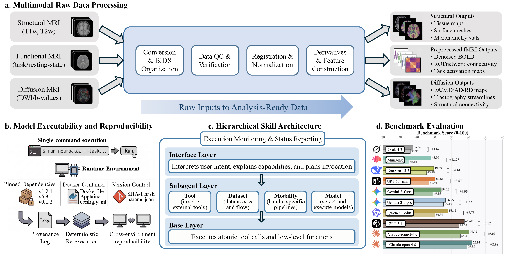

<div align="center">


# NeuroClaw：面向可执行与可复现神经影像研究的闭环智能体 AI

[](#-quick-start)
[](LICENSE)
[](skills)
[](https://arxiv.org/abs/2604.24696)

[English README](README.md)

<div align="center">

[功能概览](#-key-features) • [快速开始](#-quick-start) • [项目结构](#-project-structure) • [技能](#%EF%B8%8F-skill-quick-reference) • [致谢](#-acknowledgments)

</div>

</div>


## 📖 概述

**NeuroClaw** 是一个面向可执行、可复现神经影像研究的 Research Assistant。其核心优势在于 **神经影像数据集与模型适配**：将原始扫描快速转化为可用输入，并使临床与研究人员以最小配置成本运行深度学习模型。

神经影像数据集需要专业的预处理，而预处理质量直接决定模型有效性。许多流程假设数据已被严格整理，而 MedicalClaw 对开源模型执行的自动化支持有限（主要集中在 TimesFM 和 AlphaFold 等大型项目），导致用户需投入大量时间在环境配置上。

NeuroClaw 强调 **数据处理** 与 **模型配置/执行**。它既提供独立可用的 GUI 和 CLI 工具，也可以作为技能库集成到 OpenClaw、Hermes、Claude Code 等 agent 项目中。

**说明**
- 我们构造了 **NeuroBench** 用于评估 multi-agent 在神经影像工作流（特别是原始数据处理和模型执行）中的性能，并计划完善基准、评测现有 medical claw 与 general claw 系统。
- 每个 SKILL.md 的末尾标注作者信息，如有问题请向对应作者提交 issue。


## 🚀 更新日志

- **[2026.04.28]**：我们的技术报告已上线 arXiv：https://arxiv.org/abs/2604.24696
- **[2026.04.22]**：v1.0 发布 — 稳定版发布，包含改进与完整文档。
- **[2026.04.17]**：项目首页已上线，欢迎访问：https://cuhk-aim-group.github.io/NeuroClaw/
- **[2026.04.08]**：NeuroBench 发布，用于 multi-agent 神经影像工作流评估。
- **[2026.04.02]**：v0.1 发布，NeuroClaw 框架和核心功能完成。

<a id="key-features"></a>
## ✨ 核心特性

<div align="center">
  
</div>

### 🔄 数据感知编排
- **数据集上下文规划**：围绕数据集结构、元数据和工作流阶段来组织能力，而不是简单围绕“调用哪个工具”
- **自动技能推荐**：用户指定目标数据集后，NeuroClaw 会推荐相关技能并生成可执行工作流
- **预处理约束感知**：在编排过程中考虑特定数据集的模态可用性和预处理要求

#### 适配的数据集概况

| 数据集 | 支持模态 | 附加数据 | 队列规模 | 官方链接 |
| :---: | --- | --- | --- | :---: |
| ABCD Study | T1w; T2w; dMRI; rs-fMRI; task-fMRI | 身体与心理健康、物质使用、文化/环境、神经认知、生物学数据 | 目标队列约 11,500 名儿童；完整批次通过 NIMH Data Archive 发布 | https://abcdstudy.org/ |
| ABIDE | T1w; rs-fMRI | ASD/对照表型数据 | 来自 17 个国际站点的 1,112 份数据集 | https://fcon_1000.projects.nitrc.org/indi/abide/ |
| ADHD-200 | T1w; rs-fMRI | 诊断状态、ADHD 症状量表、人口统计学信息、用药史、质控指标 | 8 个成像站点共 776 名参与者/数据集 | https://fcon_1000.projects.nitrc.org/indi/adhd200/ |
| ADNI | T1w; T2w; FLAIR; dMRI; rs-fMRI; PET | 遗传/组学数据、临床与认知评估 | ADNI 各阶段累计约 2,000+ 名参与者 | https://adni.loni.usc.edu/ |
| BOLD5000 | T1w; task-fMRI | 视觉图像刺激、类别与图像元数据 | 4 名参与者，完成 5,000 张图像的视觉 fMRI 实验 | https://bold5000-dataset.github.io/ |
| COBRE | T1w; rs-fMRI | 人口统计学信息、利手信息、诊断信息 | 147 名参与者：72 名精神分裂症患者和 75 名健康对照 | https://fcon_1000.projects.nitrc.org/indi/retro/cobre.html |
| DMT-HAR-MED | rs-fMRI | 致幻剂干预条件、行为与生理测量 | OpenNeuro ds006644 中的 40 名参与者 | https://openneuro.org/datasets/ds006644/versions/1.0.1 |
| HBN | T1w; T2w; dMRI; rs-fMRI; task-fMRI; EEG | 精神病学、行为、认知、生活方式、遗传学、活动记录 | 已发布约 3,900+ 名参与者；目标资源不少于 10,000 名 5-21 岁个体 | https://fcon_1000.projects.nitrc.org/indi/cmi_healthy_brain_network/ |
| HCP Aging | T1w; T2w; dMRI; rs-fMRI; task-fMRI | 行为、认知、健康与人口统计学测量 | 约 700+ 名 36-100 岁成人 | https://www.humanconnectome.org/study/hcp-lifespan-aging |
| HCP Development | T1w; T2w; dMRI; rs-fMRI; task-fMRI | 行为、认知、健康与人口统计学测量 | 约 600+ 名 5-21 岁儿童与青少年 | https://www.humanconnectome.org/study/hcp-lifespan-development |
| HCP Early Psychosis | T1w; T2w; dMRI; rs-fMRI; task-fMRI | 诊断、临床、行为与认知测量 | 约 250 名早期精神病与对照参与者 | https://www.humanconnectome.org/study/hcp-early-psychosis |
| HCP Young Adult | T1w; T2w; dMRI; rs-fMRI; task-fMRI | 行为与认知测量 | 约 1,200 名青年成人参与者 | https://www.humanconnectome.org/study/hcp-young-adult |
| MND | rs-fMRI; task-fMRI | 运动神经元病诊断与临床测量 | OpenNeuro ds005874 中的 59 名参与者 | https://openneuro.org/datasets/ds005874/versions/1.1.0 |
| Natural Scenes Dataset | T1w; task-fMRI | 自然图像刺激、行为反应、图像标注 | 8 名参与者的高密度重复视觉 fMRI 数据 | https://naturalscenesdataset.org/ |
| PNC | T1w; dMRI; ASL; rs-fMRI; task-fMRI | 基因分型、临床与神经精神评估、计算机化神经认知电池 | 青少年队列超过 9,500 人；其中 1,445 人具有神经影像数据 | https://www.med.upenn.edu/bbl/philadelphianeurodevelopmentalcohort.html |
| REST-meta-MDD | rs-fMRI | MDD 诊断、临床与人口统计学测量 | 25 个队列共 2,428 名参与者 | http://rfmri.org/REST-meta-MDD |
| SEED-IV | EEG | 四类情绪标签、试次级会话元数据 | 15 名受试者，覆盖 3 次会话，用于情绪解码基准 | https://bcmi.sjtu.edu.cn/home/seed/ |
| SEED-VIG | EEG | 警觉性/疲劳标签、连续清醒度标注、行为元数据 | 23 名受试者的持续注意驾驶场景警觉性记录 | https://bcmi.sjtu.edu.cn/home/seed/ |
| TCP | rs-fMRI | 精神科诊断访谈、认知与临床评估 | 245 名跨诊断参与者 | https://openneuro.org/datasets/ds004215 |
| UCLA CNP | T1w; dMRI; rs-fMRI; task-fMRI | 诊断分组、神经心理与表型评估 | OpenNeuro ds000030 中的 272 名参与者 | https://openneuro.org/datasets/ds000030 |
| UK Biobank | T1w; T2w; FLAIR; dMRI; rs-fMRI; task-fMRI | 基因型/基因组数据、问卷、医院记录、环境数据、社会人口学数据、体格测量 | 约 50,000 名参与者具有多模态影像数据 | https://www.ukbiobank.ac.uk/ |

### 🎯 可执行性与可复现性
- **自动依赖管理**：无需手动安装，系统自动检测并解决依赖
- **真实模型执行**：不仅提供文档，还引导并执行复现
- **环境隔离**：虚拟环境与容器化避免系统污染
- **可验证流程**：完整日志与结果追踪

### 🧠 端到端科研覆盖
- **文献检索**：arXiv 搜索、PubMed 获取、学术资源整合
- **实验设计**：文献分析、方法学评估、研究方案生成
- **数据处理**：多格式转换（DICOM ↔ NIfTI）、自动化预处理流水线
- **模型执行**：运行已发表模型，深度学习框架集成
- **结果可视化**：科学数据可视化、统计图表生成
- **论文写作**：自动草稿生成、格式标准化

### 🤝 灵活集成
- **NeuroClaw 可作为独立 Research Assistant 使用**，自带 GUI 和 CLI，无需依赖其他宿主项目即可直接运行。
- `skills/`、`materials/`、`USER.md`、`SOUL.md` 也可以作为技能库安装到 OpenClaw、Hermes、Claude Code 等现有 agent 系统中。
- 内置 `core/` 引擎为独立部署提供完整的对话循环、技能加载器和工具运行时。
- 非神经科学连接器（WhatsApp、Telegram、Slack、日历、电商、SaaS 鉴权）
  已通过 `core/config/features.json` 默认禁用，如需启用可修改配置。

---

<a id="quick-start"></a>
## 🚀 快速开始

### 前置条件
- Python >= 3.10
- Git
- *（可选）* Conda/Mamba，用于环境隔离
- *（可选）* `nvidia-smi` / `nvcc`，用于 GPU 支持
- *（推荐用于 Web UI 附件解析）* `pypdf`、`python-docx`、`openpyxl`、`python-pptx`

> **NeuroClaw 可独立运行**，自带 GUI 和 CLI。
> 内置安装程序会自动配置 Python 环境、CUDA 版本、神经影像工具链和 LLM 后端。

### 安装步骤

1. **克隆仓库**
   ```bash
   git clone https://github.com/CUHK-AIM-Group/NeuroClaw.git
   cd NeuroClaw
   ```

2. **运行安装向导**
   ```bash
   python installer/setup.py
   ```
  该步骤会安装可直接用于 GUI 与 CLI 的独立 NeuroClaw 运行环境。
  向导将引导你完成：
  - Python 运行时选择（系统 Python / conda / Docker）
  - CUDA / GPU 配置，以及可选的 PyTorch 自动安装
  - 神经科学工具链路径（FSL、FreeSurfer、dcm2niix 等）
  - LLM 后端选择（OpenAI、Anthropic 或本地模型）
  - 默认 BIDS 和输出目录
  - Web UI 依赖与附件解析组件（PDF/DOCX/XLSX/PPTX）

   配置保存到 `neuroclaw_environment.json`，每次会话自动加载。
   安装阶段不再要求输入 API key。请在运行时通过 `--api-key` 传入，或在启动前导出配置对应的环境变量。

   使用自动检测默认值快速配置（无需交互）：
   ```bash
   python installer/setup.py --non-interactive
   ```

    如果你跳过了可选的 Web UI 依赖，可手动安装：
    ```bash
    pip install "fastapi[standard]" uvicorn pypdf python-docx openpyxl python-pptx
    ```

3. **启动 NeuroClaw**

   **方式 A — 终端交互模式**
   ```bash
  python core/agent/main.py --api-key "$OPENAI_API_KEY"
   ```

   **方式 B — 浏览器 Web UI**（推荐）
   ```bash
  python core/agent/main.py --web --api-key "$OPENAI_API_KEY"
   ```
   启动后在浏览器中打开 **http://localhost:7080**。Web UI 提供对话界面、技能侧边栏、Markdown 渲染和代码语法高亮。

  如果你更倾向于环境变量方式，也可以先导出对应 provider 的 key，再不带 `--api-key` 启动。

    Web UI 附件解析当前支持：
    - 文本/配置/代码：`.txt`、`.md`、`.markdown`、`.json`、`.yaml`、`.yml`、`.csv`、`.tsv`、`.py`、`.js`、`.ts`、`.tsx`、`.jsx`、`.sh`、`.bash`、`.zsh`、`.sql`、`.html`、`.css`、`.xml`、`.log`、`.rst`、`.ini`、`.toml`、`.cfg`
    - 文档类型：`.pdf`、`.docx`、`.xlsx`、`.pptx`

    Web UI 文件选择器会限制为以上受支持格式。

   如需自定义端口或绑定所有网络接口（如远程访问）：
   ```bash
  python core/agent/main.py --web --port 8080 --host 0.0.0.0 --api-key "$OPENAI_API_KEY"
   ```

<div align="center">
  
</div>

### 验证安装
```bash
# 检查环境配置文件是否有效
python installer/setup.py --check

# 列出已注册的神经科学技能
python -c "
from core.skill_loader.loader import SkillLoader
from pathlib import Path
skills = SkillLoader(Path('skills')).load_all()
for s in skills:
    print(s['name'])
"
```

### Benchmark 测试

NeuroBench 任务位于 `neuro_bench/`，每个任务目录都包含一个 `task.md` 指令文件。

NeuroBench 目前接受以下几种测试设定：
- `with-skills`：Agent 可以使用 `skills/` 目录中加载的技能
- `no-skills`：不启用技能的基线测试
- `with-skills` + `no-skills` 配对对比：使用 `--benchmark-compare-skills` 对同一批任务同时运行两种设定

评分阶段使用 `--score-benchmark` 单独完成：它会读取 `output/` 里的报告，使用 GPT-5.4 的加权评分规则，为计划完整性、工具/技能使用合理性以及命令/代码正确性生成分数。为保证公平，同一 task 会把所有可比模型放在同一批次联合打分，尽量降低评分标准漂移。报告里会单独记录 skill 调用次数，用于效率分析。

要对已有报告进行打分：
```bash
python core/agent/main.py --score-benchmark
```

如果希望在较大规模结果上加速打分：
```bash
python core/agent/main.py --score-benchmark --score-workers 8
```

**Web benchmark 模式**
```bash
python core/agent/main.py --web --benchmark
```

**命令行 benchmark 批处理模式**
```bash
python core/agent/main.py --benchmark
```

如果要在命令行下运行成对的 skill 对比测试：
```bash
python core/agent/main.py --benchmark --benchmark-compare-skills
```

在命令行 benchmark 模式下，NeuroClaw 会先询问：
- benchmark 目录路径
- benchmark 模型名

然后会自动：
- 递归读取该目录下所有 `task.md`
- 按任务文件夹名称字母顺序排序
- 逐个执行任务，中途不再要求用户确认
- 终端中只显示执行进度
- 报告按模型名保存到 `output/<model_name>/` 目录下，并为每个 case 与 run 分别生成 markdown 报告

报告会包含思路、使用的技能、skill 调用次数，以及实际使用或建议的命令/代码。

---

<a id="project-structure"></a>
## 📁 项目结构

```
NeuroClaw/
├── README.md                       # 英文版说明
├── README_zh.md                    # 中文版说明
├── USER.md                         # 用户配置与偏好
├── SOUL.md                         # 系统行为准则与原则
│
├── core/                           # 自包含 NeuroClaw 引擎（无需 OpenClaw）
│   ├── agent/                      # LLM 对话循环与工具调用调度器
│   │   └── main.py                 # 入口；--web 参数启动 Web UI
│   ├── web/                        # 浏览器端 Web UI（FastAPI + WebSocket）
│   │   ├── server.py               # FastAPI 应用：WebSocket 聊天、/api/skills、/api/env
│   │   └── static/
│   │       └── index.html          # 深色主题聊天界面（Markdown + 语法高亮）
│   ├── skill-loader/               # 技能扫描器：读取 skills/*/SKILL.md 并注册工具
│   │   └── loader.py
│   ├── tool-runtime/               # 执行 handler.js / Python handlers
│   │   └── runtime.py
│   ├── session/                    # 会话持久化与上下文窗口压缩
│   │   └── manager.py
│   └── config/
│       └── features.json           # 功能开关（禁用 WhatsApp/Slack 等；启用 web_ui）
│
├── installer/                      # 自定义安装程序（替换 OpenClaw 默认向导）
│   ├── setup.py                    # 入口：python installer/setup.py
│   ├── config_wizard.py            # 交互式 6 步配置向导（含 Web UI 依赖安装）
│   └── neuro_defaults.json         # 神经科学专用默认参数模板
│
├── skills/                         # 扁平化技能目录
│   ├── academic-research-hub/
│   ├── adni-skill/
│   ├── bids-organizer/
│   ├── beautiful-log/
│   ├── brain-visualization/
│   ├── claw-shell/
│   ├── conda-env-manager/
│   ├── conn-tool/
│   ├── dcm2nii/
│   ├── dependency-planner/
│   ├── dipy-tool/
│   ├── docker-env-manager/
│   ├── nibabel-skill/
│   ├── dwi-skill/
│   ├── eeg-skill/
│   ├── experiment-controller/
│   ├── fmri-skill/
│   ├── fmriprep-tool/
│   ├── freesurfer-tool/
│   ├── fsl-tool/
│   ├── git-essentials/
│   ├── git-workflows/
│   ├── hcp-skill/
│   ├── ukb-skill/
│   ├── harness-core/
│   ├── hcppipeline-tool/
│   ├── method-design/
│   ├── mne-eeg-tool/
│   ├── multi-search-engine/
│   ├── nii2dcm/
│   ├── nilearn-tool/
│   ├── overleaf-skill/
│   ├── paper-writing/
│   ├── qsiprep-tool/
│   ├── research-idea/
│   ├── run_models/
│   ├── skill-updater/
│   ├── smri-skill/
│   └── wmh-segmentation/
│
├── neuro_bench/                    # NeuroBench 评估任务（T00–T100）
│   ├── T00_installer_validation/   # 验证安装程序输出
│   └── …
│
├── materials/                      # 研究材料与参考资源
│   ├── CVPR_2026/
│   └── examples/
│
└── LICENSE                         # 许可证

```

---

<a id="skill-quick-reference"></a>
## 🛠️ 技能速览

> **提示**：在 Web UI 的任何技能卡片上点击 ℹ️ 图标可查看展开的文档、使用示例和最近的执行日志。

### 基础层
| Skill | 功能 | 状态 |
|------|----------|--------|
| `dcm2nii` | DICOM → NIfTI 转换并保留元数据 | ✅ |
| `nii2dcm` | NIfTI → DICOM 转换以支持临床互操作 | ✅ |
| `git-essentials` | 协作所需的核心 Git 命令 | ✅ |
| `git-workflows` | 高级 Git 工作流（rebase/worktree/bisect） | ✅ |
| `multi-search-engine` | 无需 API Key 的多引擎搜索 | ✅ |
| `conda-env-manager` | Conda 环境生命周期管理 | ✅ |
| `docker-env-manager` | Docker 环境管理 | ✅ |
| `dependency-planner` | 依赖规划与安全安装流程 | ✅ |
| `claw-shell` | 专用会话下的安全命令执行入口 | ✅ |
| `overleaf-skill` | Overleaf 同步与协作写作操作 | ✅ |
| `academic-research-hub` | 多来源学术检索与论文获取 | ✅ |
| `bids-organizer` | 原始数据组织为 BIDS 结构 | ✅ |
| `beautiful-log` | 将 User/NeuroClaw 直接对话导出为美观 HTML 日志 | ✅ |
| `skill-updater` | 技能更新与管理工具 | ✅ |

### 接口层（任务编排）
| Skill | 功能 | 状态 |
|------|----------|--------|
| `research-idea` | 基于文献生成研究想法 | ✅ |
| `method-design` | 形式化网络结构并推导理论组件 | ✅ |
| `experiment-controller` | 查找并执行可复现实验 | ✅ |
| `paper-writing` | 从 IDEA/METHOD/EXPERIMENT 生成分层稿件 | ✅ |
| `run_models` | 模型注册与执行编排 | ✅ |

### 子智能体层
NeuroClaw 的子智能体包括四类：**tool**、**model**、**dataset**、**modality**。

#### Tool
| Skill | 功能 | 状态 |
|------|----------|--------|
| `brain-visualization` | 将处理后神经影像输出转为发表级图像与 3D 资产（连接组、分区激活、FreeSurfer PLY 导出） | ✅ |
| `harness-core` | 核心 Harness SDK（验证、检查点、漂移检测、审计日志） | ✅ |
| `mne-eeg-tool` | EEG 的 MNE-Python 基础实现 | ✅ |
| `fsl-tool` | 基于 FSL 的 sMRI/fMRI/DWI 处理工具 | ✅ |
| `fmriprep-tool` | fMRIPrep 流水线封装与执行 | ✅ |
| `qsiprep-tool` | qsiPrep 扩散 MRI 流水线封装 | ✅ |
| `hcppipeline-tool` | HCP 风格处理流水线工具 | ✅ |
| `dipy-tool` | 基于 DIPY 的扩散 MRI 处理 | ✅ |
| `nibabel-skill` | 底层神经影像文件 I/O 与几何处理（NIfTI、仿射、FreeSurfer I/O） | ✅ |
| `nilearn-tool` | 快速影像特征提取与解码准备 | ✅ |
| `conn-tool` | 功能连接计算与分析 | ✅ |
| `freesurfer-tool` | 基于 FreeSurfer 的 MRI 处理与分割 | ✅ |

#### Model
| Skill | 功能 | 状态 |
|------|----------|--------|
| `wmh-segmentation` | 白质高信号分割（MARS-WMH nnU-Net） | ✅ |
| `brain_gnn` | BrainGNN：用于 fMRI 分类的图神经网络 | ✅ |
| `fm_app` | FM-APP：fMRI+sMRI 多阶段表型预测 | ✅ |
| `neurostorm` | NeuroStorm：神经影像基础模型 | ✅ |
| `glm` | 用于任务态 fMRI 激活分析与组水平推断的一二级 GLM | ✅ |
| `ica` | 基于独立成分分析的静息态网络分解 | ✅ |
| `dictlearning` | 基于字典学习的稀疏静息态网络分解 | ✅ |
| `svm` | 基于 ROI/表格特征的经典神经影像疾病分类 | ✅ |
| `spacenet` | 带稀疏系数图的体素级神经影像疾病分类 | ✅ |
| `kmeans` | 基于 K-means 聚类的脑区划分 | ✅ |
| `hierarchical` | 基于层次聚类的多尺度脑区划分 | ✅ |
| `filtering` | 面向神经影像时序信号的时间滤波去噪 | ✅ |
| `detrending` | 面向神经影像时序信号的时间漂移去除 | ✅ |

#### Dataset
| Skill | 功能 | 状态 |
|------|----------|--------|
| `adni-skill` | ADNI 数据集自动化处理流程 | ✅ |
| `hcp-skill` | HCP-YA 数据集自动化处理流程 | ✅ |
| `ukb-skill` | UKB 脑影像自动化处理流程 | ✅ |

#### Modality
| Skill | 功能 | 状态 |
|------|----------|--------|
| `eeg-skill` | EEG 预处理与特征提取流程 | ✅ |
| `fmri-skill` | 功能 MRI 预处理与分析流程 | ✅ |
| `smri-skill` | 结构 MRI 预处理与分析流程 | ✅ |
| `dwi-skill` | 扩散 MRI 预处理与分析流程 | ✅ |

**图例**：✅ 已实现 | 🏗️ 开发中 | ⏳ 规划中


---

## TODO List

### Architecture & Foundation
- ✓ Hierarchical architecture design (Interface-Subagent-Base Tool)
- ✓ Complete Interface layer implementation
- ✓ Subagent coordination mechanisms

### Dataset Ecosystem
- ✓ Complete ADNI processing chain
- ✓ HCP dataset adaptation
- ☐ UK Biobank adaptation
- ☐ Multi-dataset workflow support

### Model Reproduction & Execution
- ✓ Automatic paper model retrieval
- ✓ Automatic environment configuration
- ✓ 完整的可复现性 Harness 工程

### Community & Extensions
- ☐ Multi-institution collaboration capabilities
- ☐ Plugin ecosystem for third-party skills

---


<a id="acknowledgments"></a>
## 🙏 致谢

感谢：
- [OpenClaw](https://github.com/openclaw/openclaw) 框架贡献者
- [Karcen/rs-fMRI-Pipeline-Tutorial](https://github.com/Karcen/rs-fMRI-Pipeline-Tutorial) 提供脑可视化流程与方法参考
- 全体贡献者与用户反馈
- 开源神经科学工具社区（MNE-Python、FreeSurfer、FSL 等）
